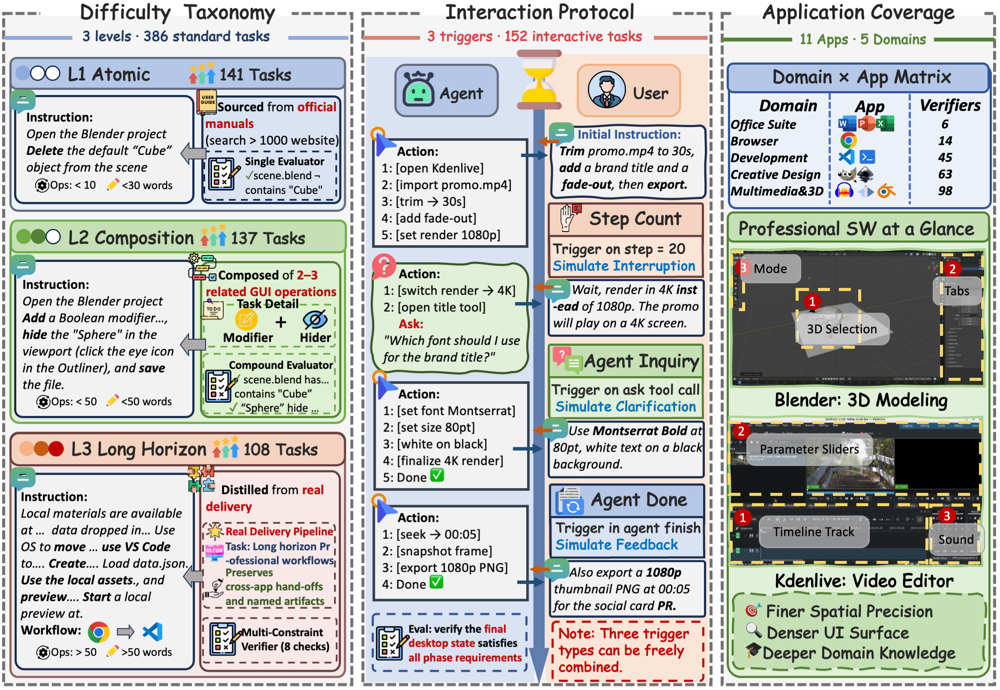

# 🖥️ DeskCraft

DeskCraft is a benchmark for evaluating desktop GUI agents on realistic professional workflows and human-in-the-loop collaboration. It accompanies our paper, **["DeskCraft: Benchmarking Desktop Agents on Professional Workflows and Human-in-the-Loop Collaboration"](https://arxiv.org/abs/2606.03103)**.

<p align="center">
  <a href="https://arxiv.org/abs/2606.03103"></a>
  <a href="https://github.com/mrwwk/DeskCraft"></a>
  <a href="https://mrwwk.github.io/DeskCraft/"></a>
  <a href="https://huggingface.co/Wenkaiwang/ubuntu-qcow2"></a>
</p>

<p align="center">
  
</p>

Most desktop-agent benchmarks focus on short tasks where all user requirements are given upfront. DeskCraft moves closer to how people actually work on a computer: tasks can span many steps, require specialized software, produce saved or exported artifacts, and evolve as the user clarifies, interrupts, or revises the request.

At a high level, DeskCraft asks whether GUI agents can:

- complete professional workflows in a live Ubuntu desktop environment;
- move from simple operations to longer delivery-style tasks;
- collaborate with users across multiple turns instead of treating the initial instruction as final.

## ✨ Highlights

- 📦 **538 executable desktop tasks**, including 386 standard tasks and 152 interactive tasks.
- 🧰 **Professional workflow coverage** across office software, browsers, development tools, creative design tools, multimedia editing, 3D creation, OS operations, and multi-app workflows.
- 🤝 **Human-in-the-loop task evolution** through deterministic phase triggers such as `agent_done`, `agent_asks`, and `step_count`.
- ✅ **Execution-based verification** using programmatic evaluators over final desktop state, project files, exported artifacts, browser state, media metadata, and structured documents.

## 🧭 Task Coverage

DeskCraft covers 11 applications plus a multi-application workflow category:

- 📝 LibreOffice Writer, Calc, and Impress
- 🌐 Chrome
- 💻 VS Code
- 🎨 GIMP and Inkscape
- 🎬 Kdenlive, Audacity, and Blender
- ⚙️ OS-level operations
- 🔀 Multi-app workflows

The benchmark contains:

- 386 standard tasks
- 152 interactive tasks
- 538 tasks in total
- 279 curated asset files across 19 file formats, including `.jpg`, `.png`, `.svg`, `.docx`, `.pptx`, `.xlsx`, `.blend`, `.wav`, `.mp4`, `.html`, `.js`, and `.json`

## 🤝 Interaction Protocol

Interactive tasks are represented as a reproducible sequence of user phases. Each phase contains a user message and a trigger condition. When the trigger fires, the user simulator injects the next message into the agent session.

The core triggers are:

- `agent_done`: the user responds after the agent claims the current phase is finished.
- `agent_asks`: the user answers when the agent explicitly asks for clarification.
- `step_count`: the user interrupts or changes constraints after a fixed number of agent steps.

The implementation also supports additional trigger types such as `agent_idle` and `llm_judge`. For a deeper walkthrough of interactive task construction and user simulation, see `README_INTERACTIVE.md`.

## 📁 Repository Layout

```text
desktopworld/
|-- README.md                        # Project overview
|-- README_INTERACTIVE.md            # Interactive evaluation guide
|-- requirements.txt                 # Python dependencies
|-- quickstart.py                    # Environment smoke test
|-- lib_run_single.py                # Standard task execution loop
|-- lib_run_interactive.py           # Interactive task execution loop
|-- desktop_env/                     # Desktop environment, providers, evaluators, getters
|-- mm_agents/                       # Agent implementations and model adapters
|-- runners/                         # Evaluation entry points for different agents
|-- evaluation_examples/
|   |-- standard_task.json
|   |-- interactive_task.json
|   `-- ubuntu_examples/             # Task JSON files grouped by application
|-- assets/                          # Task input assets
|-- monitor/                         # Monitoring utilities
`-- utils/                           # Helper utilities
```

## 🛠️ Installation

We recommend Python 3.10 or newer. If you use `pyproject.toml`, note that it currently declares Python 3.12; the core project code follows the OSWorld/desktop-env Python 3.10+ convention.

```bash
cd /path/to/DeskCraft

python -m venv .venv
source .venv/bin/activate

pip install -r requirements.txt
python -m playwright install
```

If you only need the desktop environment package in editable mode:

```bash
pip install -e .
```

## 🌍 Environment Setup

DeskCraft runs tasks inside real virtual desktops. The project supports Docker, VMware, VirtualBox, AWS, Azure, and related providers inherited from OSWorld.

### VM Image

The Ubuntu desktop VM image (`Ubuntu.qcow2`, ~25 GB) is hosted on Hugging Face:

- **Repository:** [Wenkaiwang/ubuntu-qcow2](https://huggingface.co/Wenkaiwang/ubuntu-qcow2/tree/main)
- **Direct file:** [Ubuntu.qcow2](https://huggingface.co/Wenkaiwang/ubuntu-qcow2/blob/main/Ubuntu.qcow2)

Download the image before starting Docker or other provider-based evaluation. For provider-specific import and setup steps, see the guides below.

Common environment variables:

```bash
# Agent model API. Adjust these according to the runner and backend you use.
export OPENAI_API_KEY="EMPTY"
export OPENAI_BASE_URL="http://localhost:8000/v1"

# Some provider paths may still read AWS variables even when Docker is used.
export AWS_REGION="us-east-1"
export AWS_SUBNET_ID="subnet-dummy"
export AWS_SECURITY_GROUP_ID="sg-dummy"
```

For provider-specific setup, please refer to the guides under `desktop_env/providers/`, such as:

- `desktop_env/providers/docker/DOCKER_GUIDELINE.md`
- `desktop_env/providers/aws/AWS_GUIDELINE.md`

## ⚡ Quick Start

Run a small smoke test first to make sure the virtual desktop can start, reset, execute a basic pyautogui action, and close cleanly:

```bash
python quickstart.py \
  --provider_name docker \
  --headless True
```

If everything is configured correctly, the script will reset the example environment, perform a right-click action, and close the VM/container.

## 🧪 Run Standard Tasks

Standard tasks use a single user instruction and are evaluated from the final desktop state. The task index is `evaluation_examples/standard_task.json`, and the task JSON files live under `evaluation_examples/ubuntu_examples/<domain>/`.

Example command:

```bash
python runners/run_multienv_interactive.py \
  --provider_name docker \
  --headless \
  --domain gimp \
  --test_all_meta_path evaluation_examples/standard_task.json \
  --test_config_base_dir evaluation_examples/ubuntu_examples \
  --num_envs 3 \
  --max_steps 100 \
  --model "UI-TARS-1.5-7B" \
  --result_dir ./results \
  --run_name uitars15_gimp_standard
```

Some runners still keep older OSWorld defaults such as `evaluation_examples/test_all.json` and `evaluation_examples/examples/<domain>/`. For DeskCraft tasks, please pass the index and base directory explicitly as shown above, or use a runner that supports the `evaluation_examples/ubuntu_examples/<domain>/` layout.

## 💬 Run Interactive Tasks

Interactive evaluation adds a user simulator to the normal desktop rollout. The simulator uses a separate LLM service to produce user messages when a phase trigger fires.

Example command:

```bash
python runners/run_multienv_evocua_interactive.py \
  --provider_name docker \
  --headless \
  --domain gimp \
  --test_all_meta_path evaluation_examples/interactive_task.json \
  --test_config_base_dir evaluation_examples/ubuntu_examples \
  --num_envs 3 \
  --max_steps 100 \
  --model "EvoCUA-32B" \
  --prompt_style S2 \
  --coordinate_type relative \
  --resize_factor 32 \
  --user_model "gpt-4o" \
  --user_base_url "https://api.openai.com/v1" \
  --user_api_key "$OPENAI_API_KEY" \
  --result_dir ./results \
  --run_name evocua_gimp_interactive
```

For task JSON fields, phase design, trigger behavior, `call_user` handling, and interaction logs, please see `README_INTERACTIVE.md`.

## ✅ Evaluation Design

DeskCraft uses execution-based verification rather than subjective manual scoring. Each task JSON describes:

- `config`: how to reset the VM, prepare files, create initial state, launch applications, and wait for GUI initialization;
- `instruction` or `phases`: a single instruction for standard tasks, or multi-phase user messages for interactive tasks;
- `evaluator.result`: how to retrieve evidence from the VM, such as files, command outputs, browser state, or project artifacts;
- `evaluator.expected`: rules, references, or expected state;
- `evaluator.func`: the programmatic metric used to compare the result with the expected state.

Evaluators are designed around native artifacts. For example, SVG tasks inspect XML structure, office tasks read document formats, Audacity tasks analyze audio signals and project files, Kdenlive tasks inspect project XML and rendered media metadata, Blender tasks query the scene graph through `bpy`, and system/development tasks verify files, configs, commands, browser state, or tests.

## 🧩 Add New Tasks

When adding new DeskCraft tasks, we recommend following the same construction principle used in the benchmark: keep the task realistic, but make the final state programmatically verifiable.

1. Choose the target application, initial resources, final artifact, and evaluator strategy.
2. Place the task JSON under `evaluation_examples/ubuntu_examples/<domain>/`.
3. Use `instruction` for standard tasks or `interactive: true` plus `phases` for interactive tasks.
4. Make sure the instruction clearly names the target file and save/export requirement.
5. Ensure uploaded or generated paths match the evaluator result path.
6. Reuse or implement evaluator functions under `desktop_env/evaluators/metrics/`.
7. Register evaluator functions in `desktop_env/evaluators/__init__.py`.
8. Add the task ID to `standard_task.json` or `interactive_task.json`.
9. Test the task with a small task index before running a full benchmark job.

## 📚 Citation

Thanks for your interest in DeskCraft. If you find the benchmark or code useful, we would be grateful if you cite our paper:

```bibtex
@article{wang2026deskcraft,
  title   = {{DeskCraft}: Benchmarking Desktop Agents on Professional Workflows and Human-in-the-Loop Collaboration},
  author  = {Wang, Wenkai and Xiong, Tao and Ni, Jingchen and Bao, Yunpeng and Li, Xiyun and Liu, Tianqi and Guo, Hongcan and Huang, Zilong and Zhang, Shengyu},
  journal = {arXiv preprint arXiv:2606.03103},
  year    = {2026},
  url     = {https://arxiv.org/abs/2606.03103},
  eprint  = {2606.03103},
  archivePrefix = {arXiv}
}
```

DeskCraft builds on the OSWorld / desktop-env execution framework. If you use the underlying environment infrastructure, please consider citing OSWorld as well.
