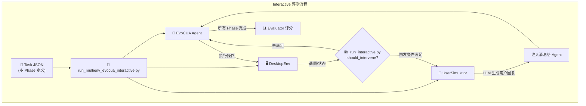
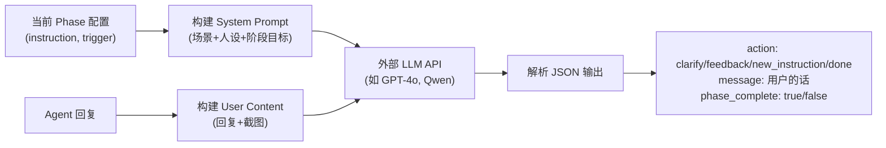
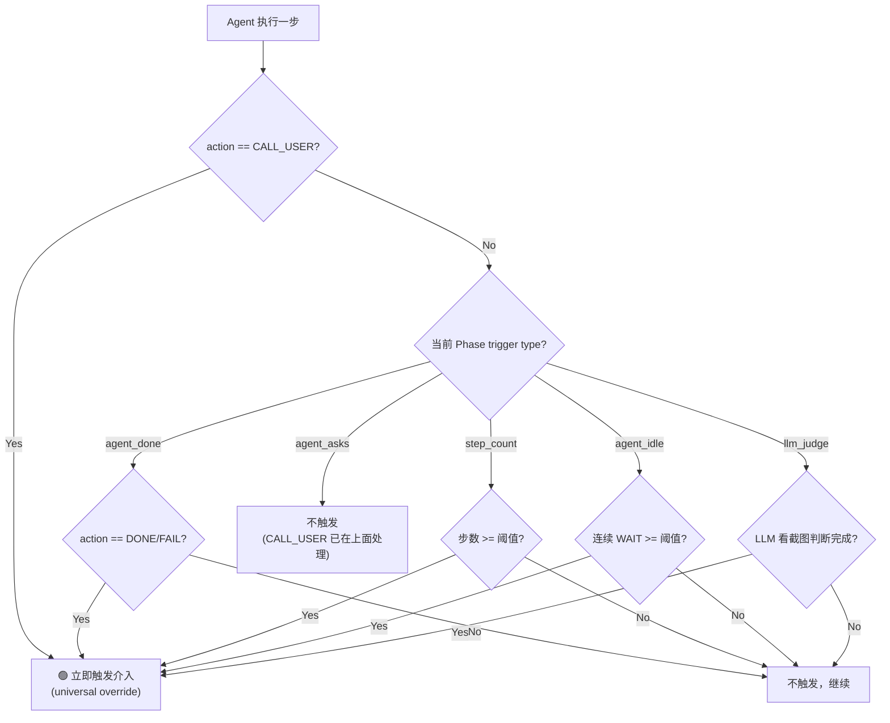
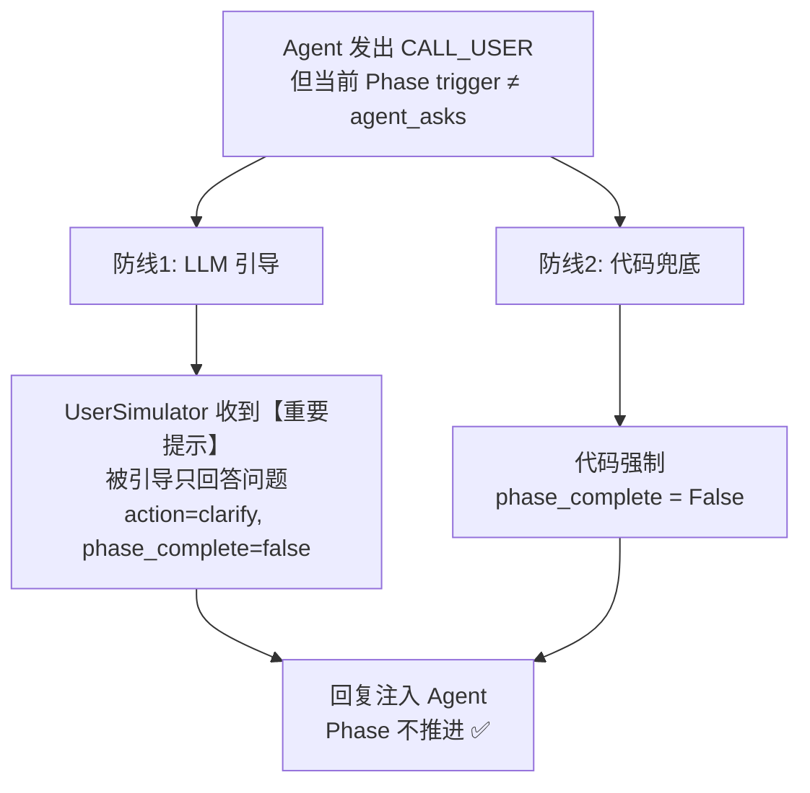
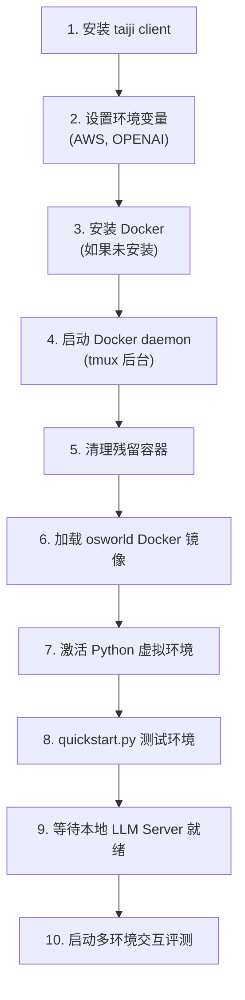

# User Interactive 多轮交互评测指南

本文档介绍 OSWorld 中 **User Interactive** 多轮交互评测功能的使用方法，包括 Task JSON 文件的构建、UserSimulator 的触发机制、EvoCUA Agent 的适配改动，以及完整的启动流程。

---

## 📋 目录

- [概述](#概述)
- [架构总览](#架构总览)
- [Task JSON 文件构建](#task-json-文件构建)
  - [基本结构](#基本结构)
  - [字段详解](#字段详解)
  - [Phase 配置](#phase-配置)
  - [Trigger 触发方式](#trigger-触发方式)
  - [完整示例](#完整示例)
- [UserSimulator 用户模拟器](#usersimulator-用户模拟器)
  - [工作原理](#工作原理)
  - [触发方式详解](#触发方式详解)
  - [安全机制：CALL_USER 误触发保护](#安全机制call_user-误触发保护)
- [EvoCUA Agent 改动](#evocua-agent-改动)
  - [新增 call_user Action](#新增-call_user-action)
  - [Interactive Prompt 切换](#interactive-prompt-切换)
  - [消息注入机制](#消息注入机制)
  - [历史清理](#历史清理)
- [启动脚本说明](#启动脚本说明)
  - [脚本参数详解](#脚本参数详解)
  - [启动流程](#启动流程)
- [文件结构](#文件结构)
- [FAQ](#faq)

---

## 概述

传统 OSWorld 评测采用**单轮指令 → Agent 执行 → 评分**的流程，Agent 只需执行一条固定指令。

**User Interactive** 扩展了这一模式，支持**多阶段、多轮**的用户-Agent 交互场景，模拟真实用户在使用 AI 助手时的行为模式，包括：

| 场景类型 | 说明 | 示例 |
|---------|------|------|
| `requirement_change` | 用户中途改变需求 | "先按第一列排序" → "等等，改成按第二列排" |
| `ambiguous_instruction` | 用户指令模糊，需要 Agent 主动提问 | "帮我整理一下桌面" |
| `progressive_refinement` | 用户逐步细化需求 | "调亮一点" → "裁剪成 800x600" → "导出为 JPEG" |
| `interruption` | 用户在 Agent 执行过程中打断 | Agent 执行 2 步后用户改变主意 |
| `correction` | 用户纠正 Agent 的错误操作 | "不对，我说的是另一个文件" |

---

## 架构总览



核心模块：

| 模块 | 文件 | 职责 |
|------|------|------|
| 交互主循环 | `lib_run_interactive.py` | 管理多 Phase 执行流程，协调 Agent 与 UserSimulator |
| 用户模拟器 | `mm_agents/user_simulator.py` | 基于 LLM 模拟用户行为，生成自然语言回复 |
| EvoCUA Agent | `mm_agents/evocua/evocua_agent.py` | 任务执行 Agent，支持 `call_user` 动作 |
| Prompt 定义 | `mm_agents/evocua/prompts.py` | 包含 `call_user` 的 S1/S2 prompt 模板 |
| 入口脚本 | `run_multienv_evocua_interactive.py` | 多环境并行运行入口 |

---

## Task JSON 文件构建

### 基本结构

Interactive Task JSON 文件存放在 `evaluation_examples/examples/interactive/` 目录下。与标准 Task JSON 的核心区别是：

1. **`"interactive": true`** 标记为交互任务
2. **`"phases"` 数组** 替代单一 `"instruction"` 字段，定义多阶段交互流程
3. 新增 **`"scenario_description"`** 和 **`"user_persona"`** 字段

### 字段详解

```jsonc
{
    // === 基本信息 ===
    "id": "interactive_calc_requirement_change_001",  // 唯一 ID，建议格式: interactive_{app}_{scenario}_{序号}
    "snapshot": "libreoffice_calc",                    // 使用的 VM 快照
    "interactive": true,                               // 【必须】标记为交互任务

    // === 场景描述 ===
    "scenario_type": "requirement_change",             // 场景类型（用于分类统计）
    "scenario_description": "用户要求对表格排序...",     // 场景总体描述（UserSimulator system prompt 会引用）
    
    // === 用户人设 ===
    "user_persona": {
        "expertise_level": "beginner",                 // 用户水平: beginner / intermediate / expert
        "communication_style": "casual_chinese"        // 说话风格: casual_chinese / formal_chinese / technical 等
    },

    // === 环境配置（与标准 Task 相同）===
    "config": [ ... ],

    // === 【核心】多阶段交互定义 ===
    "phases": [ ... ],

    // === 评估器（与标准 Task 相同，只评估最终状态）===
    "evaluator": { ... },

    // === 其他标准字段 ===
    "trajectory": "trajectories/",
    "related_apps": ["libreoffice_calc"],
    "proxy": false,
    "fixed_ip": false,
    "possibility_of_env_change": "low"
}
```

### Phase 配置

`phases` 数组中每个元素定义一个交互阶段：

```jsonc
{
    "phase_id": 1,                          // 阶段编号（从 1 开始）
    "instruction": "帮我把表格按第一列排序",   // 本阶段用户的指令/需求
    "trigger": {                            // 触发条件：何时推进到下一阶段
        "type": "agent_done"                // 触发类型（详见下节）
        // "value": 5                       // 部分触发类型需要额外参数
    }
}
```

### Trigger 触发方式

Trigger 定义了**何时由 UserSimulator 介入并推进到下一阶段**。共支持 5 种触发方式：

| 触发类型 | `type` 值 | 说明 | 额外参数 |
|---------|----------|------|---------|
| Agent 完成 | `agent_done` | Agent 发出 DONE/FAIL 时触发 | 无 |
| 步数触发 | `step_count` | Agent 执行指定步数后触发 | `value`: 步数阈值 |
| Agent 主动提问 | `agent_asks` | Agent 发出 `call_user` 时触发 | 无 |
| Agent 空闲 | `agent_idle` | Agent 连续 WAIT 达到阈值时触发 | `value`: 等待次数阈值 |
| LLM 判断 | `llm_judge` | 用 LLM 看截图判断是否完成 | 无 |

#### 各触发方式使用场景

**`agent_done`** — 最常用，适合每阶段有明确目标的场景：
```json
{
    "phase_id": 1,
    "instruction": "帮我把图片调亮一点",
    "trigger": { "type": "agent_done" }
}
```

**`step_count`** — 适合需要在 Agent 执行中途打断的场景：
```json
{
    "phase_id": 1,
    "instruction": "帮我建 5 个文件夹",
    "trigger": { "type": "step_count", "value": 2 }
}
```
> Agent 执行 2 步后，UserSimulator 介入说"等等，我改主意了..."

**`agent_asks`** — 适合模糊指令场景，期望 Agent 主动提问：
```json
{
    "phase_id": 1,
    "instruction": "我桌面东西太多了，帮我整理一下吧",
    "trigger": { "type": "agent_asks" }
}
```
> Agent 应该主动调用 `call_user` 询问"您希望怎么整理？"，然后 UserSimulator 回复细化指令

**`agent_idle`** — 适合等待场景：
```json
{
    "trigger": { "type": "agent_idle", "value": 3 }
}
```

**`llm_judge`** — 适合无法通过动作判断完成状态的场景（较慢，需要额外 API 调用）：
```json
{
    "trigger": { "type": "llm_judge" }
}
```

### 完整示例

#### 示例 1：需求变更场景 (`agent_done`)

```json
{
    "id": "interactive_calc_requirement_change_001",
    "snapshot": "libreoffice_calc",
    "interactive": true,
    "scenario_type": "requirement_change",
    "scenario_description": "用户要求对表格数据排序，但中途改变了排序方式",
    "user_persona": {
        "expertise_level": "intermediate",
        "communication_style": "casual_chinese"
    },
    "config": [
        {
            "type": "download",
            "parameters": {
                "files": [{
                    "url": "https://example.com/SalesData.xlsx",
                    "path": "/home/user/Desktop/SalesData.xlsx"
                }]
            }
        },
        {
            "type": "open",
            "parameters": { "path": "/home/user/Desktop/SalesData.xlsx" }
        }
    ],
    "phases": [
        {
            "phase_id": 1,
            "instruction": "帮我把这个表格按照第一列从小到大排序",
            "trigger": { "type": "agent_done" }
        },
        {
            "phase_id": 2,
            "instruction": "等一下，我改主意了，帮我按第二列从大到小排序吧，先撤销掉刚才的操作",
            "trigger": { "type": "agent_done" }
        },
        {
            "phase_id": 3,
            "instruction": "好的，排完之后帮我保存一下文件",
            "trigger": { "type": "agent_done" }
        }
    ],
    "evaluator": {
        "func": "check_include_exclude",
        "result": {
            "type": "vm_command_line",
            "command": "python -c \"...\" && echo 'PASSED' || echo 'FAILED'"
        },
        "expected": {
            "type": "rule",
            "rules": { "include": ["PASSED"], "exclude": ["FAILED"] }
        }
    }
}
```

#### 示例 2：模糊指令场景 (`agent_asks`)

```json
{
    "id": "interactive_os_ambiguous_001",
    "snapshot": "os",
    "interactive": true,
    "scenario_type": "ambiguous_instruction",
    "scenario_description": "用户给出模糊的桌面整理指令，期望 Agent 主动询问细节",
    "user_persona": {
        "expertise_level": "beginner",
        "communication_style": "casual_chinese"
    },
    "config": [
        {
            "type": "execute",
            "parameters": {
                "command": ["bash", "-c",
                    "touch /home/user/Desktop/photo1.png /home/user/Desktop/notes.txt; mkdir -p /home/user/Pictures /home/user/Documents"
                ]
            }
        }
    ],
    "phases": [
        {
            "phase_id": 1,
            "instruction": "我桌面东西太多了，帮我整理一下吧",
            "trigger": { "type": "agent_asks" }
        },
        {
            "phase_id": 2,
            "instruction": "把图片文件移到 Pictures，文档移到 Documents",
            "trigger": { "type": "agent_done" }
        }
    ],
    "evaluator": { "..." : "..." }
}
```

#### 示例 3：中途打断场景 (`step_count`)

```json
{
    "id": "interactive_os_stepcount_001",
    "snapshot": "os",
    "interactive": true,
    "scenario_type": "interruption",
    "scenario_description": "用户要求创建文件夹，但在执行几步后改变主意",
    "user_persona": {
        "expertise_level": "beginner",
        "communication_style": "casual_chinese"
    },
    "phases": [
        {
            "phase_id": 1,
            "instruction": "帮我建 5 个叫 project1-5 的文件夹",
            "trigger": { "type": "step_count", "value": 2 }
        },
        {
            "phase_id": 2,
            "instruction": "等一下，改成建 frontend 和 backend 两个文件夹",
            "trigger": { "type": "agent_done" }
        }
    ]
}
```

---

## UserSimulator 用户模拟器

### 工作原理

`UserSimulator` 是一个**基于 LLM 的用户角色扮演器**，通过外部 API（独立于 Agent 的模型服务）模拟真实用户行为。



UserSimulator 的 System Prompt 包含以下信息：
- **场景描述** (`scenario_description`)
- **用户人设** (expertise_level, communication_style)
- **已完成阶段摘要** (避免重复提出已完成的要求)
- **当前阶段目标** (instruction)
- **对话历史** (最近 8 轮 + 初始指令)

LLM 输出固定 JSON 格式：
```json
{
    "action": "new_instruction",
    "message": "等一下，我改主意了，帮我按第二列排序",
    "phase_complete": true
}
```

| action 值 | 含义 |
|-----------|------|
| `new_instruction` | 提出新的操作要求（进入下一阶段） |
| `feedback` | 对 Agent 操作给出反馈（"做得好" / "不对"） |
| `clarify` | 回答 Agent 的问题或澄清要求 |
| `wait` | Agent 还在操作中，继续等待 |
| `done` | 所有任务完成，结束交互 |

### 触发方式详解

每一步结束后，`lib_run_interactive.py` 调用 `user_sim.should_intervene()` 判断是否需要用户介入：



**关键设计**：`CALL_USER` 是 **universal override**，无论当前 Phase 的 trigger 类型是什么，Agent 发出 `CALL_USER` 都会触发介入（防止 Agent 等待用户回复的死循环）。

### 安全机制：CALL_USER 误触发保护

当 Agent 在**非 `agent_asks` 的 Phase** 误触发 `CALL_USER` 时，系统提供**双重防线**：



| 防线 | 作用 | 机制 |
|------|------|------|
| **防线1：LLM 引导** | 让 UserSimulator 生成语义正确的回复 | 在 LLM 消息中注入"只回答问题，不推进阶段"的提示 |
| **防线2：代码兜底** | 即使 LLM 误判，也阻止 Phase 推进 | 强制 `phase_complete = False` |

---

## EvoCUA Agent 改动

为支持 Interactive 模式，EvoCUA Agent 做了以下适配改动：

### 新增 call_user Action

在 `mm_agents/evocua/prompts.py` 中，为 S1 和 S2 两种 prompt 风格都新增了 `call_user` action：

**S1 风格**（Code Block）：
```python
S1_CALL_USER_TOOL = """- {"name": "computer.call_user", "description": "When the user's 
instruction is unclear or ambiguous, ask the user for clarification before proceeding", 
"parameters": {"type": "object", "properties": {"question": {"type": "string", 
"description": "The question to ask the user"}}, "required": ["question"]}}"""
```

**S2 风格**（Tool Call）：
```python
S2_ACTION_CALL_USER = """* `call_user`: When the user's instruction is unclear or 
ambiguous, ask the user for clarification before proceeding."""
```

`call_user` action 只在 `is_interactive=True` 时暴露给 Agent，防止在非交互任务中浪费步数。

### Interactive Prompt 切换

在 `mm_agents/evocua/evocua_agent.py` 中新增了 3 个方法：

```python
def set_interactive_prompt(self, enable: bool = True):
    """Switch to interactive prompt that includes call_user action."""
    self.is_interactive = enable

def receive_user_message(self, message: str):
    """Receive a new user message for multi-turn interactive evaluation."""
    self.pending_user_messages.append(message)

def clear_done_from_history(self):
    """Remove the trailing DONE/FAIL action from history so that the agent
    does not see a previous terminate when continuing after a phase transition."""
```

### 消息注入机制

当 UserSimulator 生成新消息后，通过 `agent.receive_user_message(message)` 注入。在下一次 `agent.predict()` 调用时，消息以 `[用户追加消息]` 的形式追加到指令中：

```python
def predict(self, instruction, obs):
    if self.pending_user_messages:
        extra_messages = "\n".join(self.pending_user_messages)
        instruction = f"{instruction}\n\n[用户追加消息]:\n{extra_messages}"
        self.pending_user_messages.clear()
```

此外，当 `is_interactive=True` 时，Agent 的 prompt 中会追加一段 interactive hint：

> *Note: This is an interactive session. If the user's instruction is unclear or you need more information, use the `call_user` action to ask the user for clarification.*

### 历史清理

当 Agent 在某个 Phase 末尾发出 `DONE`，但还有后续 Phase 时，`clear_done_from_history()` 会从 Agent 历史中移除 DONE 记录，避免 Agent 在下一阶段误以为任务已完成：

```python
def clear_done_from_history(self):
    if self.actions and self.actions[-1] in ("DONE", "FAIL", ...):
        self.actions.pop()
    # Also trim corresponding response/screenshot to keep lengths in sync
```

---

## 启动脚本说明

启动脚本位于 `taiji_task/start_evocua_interactive.sh`。

### 脚本参数详解

运行的核心命令为：

```bash
python run_multienv_evocua_interactive.py \
    --domain interactive \
    --test_all_meta_path evaluation_examples/interactive_all.json \
    --provider_name docker \
    --headless \
    --num_envs 3 \
    --max_steps 100 \
    --model "EvoCUA-32B-20260105" \
    --prompt_style S2 \
    --max_history_turns 4 \
    --coordinate_type relative \
    --resize_factor 32 \
    --user_base_url "http://29.160.43.141:8000/v1" \
    --user_api_key "EMPTY" \
    --user_model "Qwen3.5-122B-A10B"
```

参数分为 4 组：

#### 环境参数

| 参数 | 值 | 说明 |
|-----|---|------|
| `--provider_name` | `docker` | 使用 Docker 容器化 VM |
| `--headless` | (flag) | 无头模式运行 |
| `--num_envs` | `3` | 并行运行 3 个环境 |
| `--max_steps` | `100` | 所有 Phase 的总步数上限 |

#### Agent 参数

| 参数 | 值 | 说明 |
|-----|---|------|
| `--model` | `EvoCUA-32B-20260105` | Agent 模型名（对应 VLLM 服务中的模型） |
| `--prompt_style` | `S2` | Prompt 风格：S2 为 Tool Calling 风格 |
| `--max_history_turns` | `4` | 保留最近 4 轮历史上下文 |
| `--coordinate_type` | `relative` | 坐标格式：相对坐标 |
| `--resize_factor` | `32` | 图片缩放因子 |

#### UserSimulator 参数

| 参数 | 值 | 说明 |
|-----|---|------|
| `--user_model` | `Qwen3.5-122B-A10B` | UserSimulator 使用的 LLM 模型 |
| `--user_base_url` | `http://29.160.43.141:8000/v1` | UserSimulator LLM API 地址 |
| `--user_api_key` | `EMPTY` | UserSimulator API Key |
| `--user_temperature` | `0.7` (默认) | UserSimulator 采样温度 |

#### 任务参数

| 参数 | 值 | 说明 |
|-----|---|------|
| `--domain` | `interactive` | 只运行 interactive 域的任务 |
| `--test_all_meta_path` | `evaluation_examples/interactive_all.json` | 任务索引文件 |

### 启动流程

脚本的完整执行流程如下：



**注意事项**：

1. **Agent 模型服务**：脚本通过 `OPENAI_BASE_URL=http://localhost:8000/v1` 连接本地 VLLM 服务，需要在同一台机器上先启动 VLLM 部署 Agent 模型
2. **UserSimulator 模型服务**：通过 `--user_base_url` 连接外部 LLM 服务（独立于 Agent），两者互不干扰
3. **Docker 镜像**：需要提前准备 `osworld_image.tar` 文件在代码目录下
4. **断点续跑**：脚本内置了断点续跑功能（`get_unfinished`），已完成的任务（有 `result.txt`）会自动跳过

### 环境变量

需要确保以下环境变量已设置：

```bash
# Agent 模型 API
export OPENAI_API_KEY="EMPTY"
export OPENAI_BASE_URL="http://localhost:8000/v1"

# AWS dummy vars (避免 import 报错)
export AWS_REGION="us-east-1"
export AWS_SUBNET_ID="subnet-dummy"
export AWS_SECURITY_GROUP_ID="sg-dummy"
```

---

## 文件结构

```
OSWorld/
├── lib_run_interactive.py                      # 交互主循环（核心）
├── run_multienv_evocua_interactive.py          # 多环境并行入口
├── mm_agents/
│   ├── user_simulator.py                       # UserSimulator 实现
│   └── evocua/
│       ├── evocua_agent.py                     # EvoCUA Agent（含 interactive 改动）
│       └── prompts.py                          # Prompt 模板（含 call_user）
├── evaluation_examples/
│   ├── interactive_all.json                    # 交互任务索引
│   └── examples/interactive/
│       ├── interactive_calc_requirement_change_001.json
│       ├── interactive_os_ambiguous_001.json
│       ├── interactive_os_stepcount_001.json
│       ├── interactive_gimp_progressive_001.json
│       ├── interactive_gimp_correction_001.json
│       ├── interactive_writer_interruption_001.json
│       └── interactive_impress_workflow_001.json
├── desktop_env/evaluators/metrics/
│   └── interactive.py                          # Interactive 评估指标（代理到标准 evaluator）
└── taiji_task/
    └── start_evocua_interactive.sh             # 启动脚本
```

---

## 新增 Task 步骤

1. **创建 Task JSON** — 在 `evaluation_examples/examples/interactive/` 下创建新 JSON 文件，按上述格式填写
2. **注册到索引** — 在 `evaluation_examples/interactive_all.json` 中添加新任务 ID：
   ```json
   {
       "interactive": [
           "...",
           "your_new_task_id"
       ]
   }
   ```
3. **准备 VM 快照** — 确保 `snapshot` 字段对应的 VM 快照存在
4. **测试运行** — 可以修改 `interactive_all.json` 只保留新任务 ID 进行单独测试

---

## FAQ

### Q: UserSimulator 和 Agent 用的是同一个模型吗？

不是。它们**完全独立**：
- **Agent** 通过 `OPENAI_BASE_URL` 连接本地 VLLM 服务
- **UserSimulator** 通过 `--user_base_url` 连接外部 LLM API

这样设计是为了避免自说自话。

### Q: 如果 Agent 没有调用 call_user 就发了 DONE，会怎样？

如果当前 Phase 的 trigger 是 `agent_done`，DONE 会正常触发 Phase 推进。如果 trigger 是 `agent_asks`，DONE 不会触发介入，Agent 会提前结束任务。

### Q: max_steps 是每个 Phase 的还是总共的？

是**所有 Phase 的总步数**。如果 3 个 Phase 总共用了超过 `max_steps` 步，任务会强制结束。

### Q: 如何调试单个 Interactive 任务？

修改 `interactive_all.json` 只保留目标任务 ID，设置 `--num_envs 1` 单进程运行，查看 `results/` 目录下的 `interaction_log.json` 和 `traj.jsonl`。

### Q: 如何查看交互日志？

每个任务完成后会在结果目录生成：
- `interaction_log.json` — 每次用户介入的详细记录（Phase、action、message、phase_complete）
- `traj.jsonl` — 每步 Agent 操作的轨迹（含 Phase 编号）
- `runtime.log` — 完整运行日志
- `recording.mp4` — 屏幕录制
